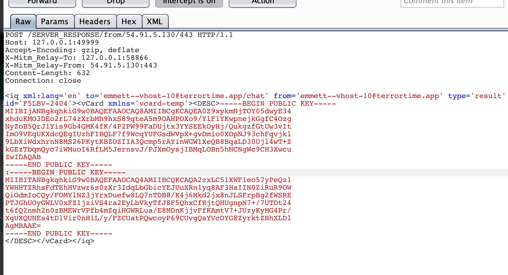

# Task 6b - Future Message Decryption

## Prompt

Though we might be unable to decrypt messages sent and received in the past without a user's private key, it may still be possible to view future messages in the clear. For this task generate a new public/private key pair and make whatever changes are necessary such that all future messages sent/received within TerrorTime may be decrypted with this private key. Critically, you can not disrupt future legitimate conversations between users.

## Solution

### Recon

In the first half of this task we were able to cover our tracks by deleting entries from vCards. Now we have to take the opposite approach and edit all of the vCards to include our Public Key Pair. First we need some keys though! `crypto/Keygen.java` is generating 2048 bit RSA keys so we will do the same.

```
$ openssl genrsa -out rsa.private 2046
$ openssl rsa -in rsa.private -out rsa.public -pubout -outform PEM
```

Now, our top-level organization leader only has three contacts, likely meaning three terrorist cells. If each terrortist cell only has two members like all of the cells we've seen so far, then that's a total of 10 users. We can login as all of Malia's contacts to work out the name, and if you look at the login traffic in Burp you can even see which group each terrortist belongs to.


Doing this for all of the cell leaders reveals the following users:

* management
    * malia
    * aden
    * leila
    * savannah
    
* cell-0
    * jason
    * jazmin

* cell-1
    * isaac
    * georgia

* cell-2
    * ava
    * emmett

### Injecting Backdoor

This doesn't seem too bad to just brute force, and a lot easier than making our own client to auth into each user and reset the vCard. So, logging into each user and sending the vCard reset request with only our Public Key should do the trick. Except, the keys to this challenge will not be accepted unless users' legitimate public keys are not included in the vCard. So instead what we should do is set up a Burp filter to intercept all server responses containing the vCard and add ours. When the vCard reset takes place then ours will be included along with the spoofed key.


While we're doing this it's a good idea to save each user's public key because we may need it in Task 7. So copy over the legitimate key, add our key to the server response with the vCard, and then forward it!



That was not fun, but after changing the vCard for all 10 users we should be able to read all future messages without interfering in legitimate conversations!
